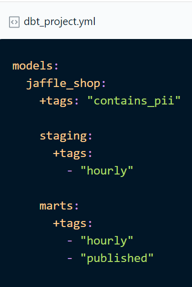
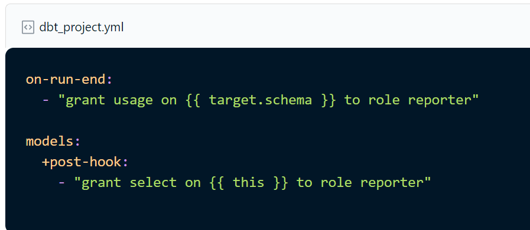
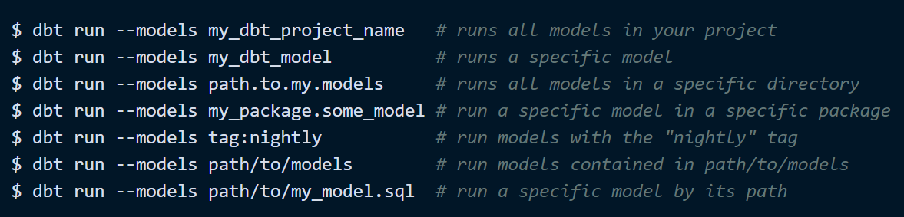
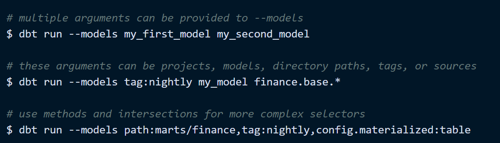

# dbt-template

template for dbt development

## welcome

Welcome to your new dbt project!

### Using the starter project

Try running the following commands:

- dbt run
- dbt test

### Resources

- Learn more about dbt [in the docs](https://docs.getdbt.com/docs/introduction)
- Check out [Discourse](https://discourse.getdbt.com/) for commonly asked questions and answers
- Join the [chat](https://community.getdbt.com/) on Slack for live discussions and support
- Find [dbt events](https://events.getdbt.com) near you
- Check out [the blog](https://blog.getdbt.com/) for the latest news on dbt's development and best practices

## environment

- devbox & direnv
- uv with python 3.11

## Directory Structure

```md
.
├── dbt-bq
│   ├── analyses
│   ├── dbt_packages
│   ├── dbt_project.yml
│   ├── logs
│   ├── macros
│   ├── models
│   │   ├── example
│   │   │   ├── my_first_dbt_model.sql
│   │   │   ├── my_second_dbt_model.sql
│   │   │   └── schema.yml
│   │   ├── mart
│   │   │   └── weekly_avg_cases_per_country.sql
│   │   └── staging
│   │       ├── covid_stats.sql
│   │       ├── schema.yml
│   │       └── sources.yml
│   ├── seeds
│   ├── snapshots
│   ├── target
│   └── tests
├── devbox.json
├── img
│   └── dbt.png
├── logs
│   └── dbt.log
├── pyproject.toml
└── requirements.txt

```

- **.github**: Github Actions workflows which are currently active.
- **dbt-bq**: A sample dbt project with BigQuery adapter.
- **deployments**: This directory contains various options to deploy dbt jobs.
- **utils**: Utility libraries.

## Introduction to dbt

**dbt (data build tool)** enables analytics engineers to transform data in their warehouses by simply writing select
statements. dbt handles turning these select statements into tables and views. It is appropriate for anyone who
interacts with a data warehouse - it can be used by data engineers, data analysts and data scientists, or anyone that
knows how to write select queries in SQL.

**dbt** does the *T* in *ELT* (Extract, Load, Transform) processes – it doesn’t extract or load data, but it’s
extremely good at transforming data that’s already loaded into your warehouse. In a nutshell, each stage of your
transformation pipeline is called a "model" and is defined in a SQL file.

**dbt natively** supports connections to:  

- Snowflake
- BigQuery
- Redshift
- Postgres data warehouses
- Databricks

and there’s a number of **community-supported adapters** for other warehouses, like:

- Microsoft SQL Server
- Microsoft Azure Synapse DW
- Oracle Database
- ClickHouse

It supports scheduling of workflows, continuous integration (CI)

### Running a dbt project

Currently, dbt workflows can be run using:

- dbt IDE (Web)
- dbt CLI
- dbt APIs (docs.getdbt.com)
- Cron scheduled Github Actions
- using Airflow/Composer (Running dbt in Production | docs.getdbt.com)
- using Cloud Build trigger and Cloud Scheduler
- using Cloud Run and Cloud Scheduler

## Concepts

Here you can find an introduction to common concepts used within data built tool environment.

### Models

A model is a select statement. Models are defined in .sql files (typically in your models directory):

- Each .sql file contains one model / select statement
- The name of the file is used as the model name
- Models can be nested in subdirectories within the models directory

When you execute dbt run, dbt will build this as views named after your models in your target schema. By default dbt
will:

- create models as views
- build models in a target schema you define
- use your file name as the view or table name in the database

The project structure can be seen below. The main components are:

- dbt_project.yml file where you list all the model transformations (business objects) which dbt materializes them upon
runtime (view / table)
- profiles.yml file where you define profile for your data warehouse
- packages.yml file where you define custom dbt packages you want to use

### Tags

We can assign tags to models in dbt config file, which affect running:



### Hooks

Hooks are snippets of SQL that are executed at different times:  

- pre-hook: executed before a model, seed or snapshot is built.
- post-hook: executed after a model, seed or snapshot is built.
- on-run-start: executed at the start of dbt run, dbt seed or dbt snapshot
- on-run-end: executed at the end of dbt run, dbt seed or dbt snapshot



### Custom schemas

By default, all dbt models are built in the schema specified in your target. In dbt projects with lots of models, it
may be useful to instead build some models in schemas other than your target schema – this can help logically group
models together.  
  
For example, you may wish to:

- Group models based on the business unit using the model, creating schemas such as core, marketing, finance, and
support; or,
- Hide intermediate models in a staging schema, and only present models that should be queried by an end-user in an
analytics schema.
  
You can use custom schemas in dbt to build models in a schema other than your target schema. It's important to note
that by default, dbt will generate the schema name for a model by concatenating the custom schema to the target schema,
as in <target_schema>_<custom_schema>;

### Tests

Tests are assertions you make about your models and other resources in your dbt project (e.g. sources, seeds and
snapshots). When you run dbt test, dbt will tell you if each test in your project passes or fails.  
  
There are two type of tests:

- schema tests (more common): applied in YAML, returns the number of records that do not pass an assertion — when this
number is 0, all records pass, therefore, your test passes
- data tests: specific queries that return 0 records
  
Out of the box, dbt ships with the following tests:

- unique
- not_null
- accepted_values
- relationships (i.e. referential integrity)

### Packages

Installing packages is done through yet another yaml file.
In order to do that create packages.yml file inside the root level of your dbt project. inside place the following
structure for different packages.  
Example of the file:

```
packages:
  - package: brooklyn-data/dbt_artifacts
    version: 0.7.0
  - package: dbt-labs/logging
    version: 0.6.0
  - package: dbt-labs/dbt_utils
    version: 0.8.4
```

## Commands

---

**NOTE**  
Everything here will be described and commands are being used in CLI version of the dbt. These commands can work in
Cloud version also but we would presume that CLI version is setup. All the commands listed below are executed with the
default .dbt profile. If we want to use specific dbt profile, we can provide it with --profiles-dir "path to the
profile.yaml

---

### Initializing dbt project

To initialize locally dbt project, and presuming that dbt CLI has been installed locally, you should input the
following command:

```
dbt init <project_name>
```

The project name can only contain:

- letters
- numbers
- underscores (_)

---

**WARNING**  
Initialization of the project guides you through the process of initial creation and configuration of the dbt project.
In order to successfully finish the process of initialisation you should have at least Service Account key file that
needs the BigQuery Admin permissions in order to work! Next, Creation of the dataset inside BigQuery is a must in which
will dbt create all the resources configured in dbt_project.yml file

---

### dbt compile

In order to compile and see what is the result and the actual SQL query that is going to be executed you should run:

```
dbt compile
```
  
---

**NOTE**  
All the compiled code can be found inside target/ directory

---

### dbt run

When dbt run is executed, dbt will automatically run every model in the models directory.

The subfolder structure within the models directory can be leveraged for organizing the project as the data team sees
fit. Example:  

```
dbt run -s staging
```

will run all models that exists in models/staging folder

If some of the objects already exists in the BigQuery in order to recreate all the models you should run:  

```
dbt with --full-refresh
```

In order to run specific model --select flag has to be used following the model name (model name is the name of the SQL
file without the .sql suffix).

```
dbt run --select customers_daily_summary
```

---

**NOTE**  
Everything that has been run through the CLI version does not support the preview functionality as it has on cloud
version. So after each run you should go to the BigQuery console and see what are the actual outputs there, either it
is materialised through views/tables

---

### Running a specific transformation (or model)

Single transformation can be run by executing a --models command

```
dbt run --models stg_orders
```

Multiple models can be run by listing them separated by space:

```
dbt run --models stg_orders customers
```

Some other examples of running parts of workflows (components):

  



### dbt test

```
dbt test runs all tests in the dbt project
dbt test --select test_type:generic
dbt test --select test_type:singular
dbt test --select one_specific_model
```

### Types of tests in dbt

In dbt, there are two types of tests - schema tests and data tests:

- Generic tests are written in YAML and return the number of records that do not meet your assertions. These are run on
specific columns in a model.
- Specific tests are specific queries that you run against your models. These are run on the entire model.

dbt ships with four built in tests:

- unique
- not null
- accepted values
- relationships

**Unique tests** to see if every value in a column is unique.  
**Not_null tests** to see if every value in a column is not null.  
**Accepted_values tests** to make sure every value in a column is equal to a value in a provided list.  
**Relationships tests** to ensure that every value in a column exists in a column in another model
(see: referential integrity).  
  
Generic tests are configured in a YAML file, whereas specific tests are stored as select statements in the tests folder.

### Documentation

```dbt docs``` generate will generate all the necessary documentation available in yaml files.  
For the CLI version of the dbt after generating dbt documentation in order to serve and view documentation you need to
run.
```dbt docs serve``` --> this will open up the web browser page that will be the same as the cloud version.

## Jinja

DBT uses Jinja a templating language written in the python programming language. With Jinja, you can do transformations
that are generally not possible in SQL, like using environment variables, or macros — abstract snippets of SQL, which
are analogous to functions in most programming languages. Jinja is used in dbt to write functional SQL. For example, we
can write a dynamic pivot model using Jinja.  
  
There are three Jinja delimiters to be aware of in Jinja.  

-  is used for statements. These perform any function programming such as setting a variable or starting a for
loop.
- {{ … }} is used for expressions. These will print text to the rendered file. In most cases in dbt, this will compile
your Jinja to pure SQL.
- {# … #} is used for comments. This allows us to document our code inline. This will not be rendered in the pure SQL
that you create when you run dbt compile or dbt run.
- Similar to Python, if we want to reference or change the value of the variable, such variable should be used without
{{…}} brackets. The example can be found in the code snippet below.
  
When using Jinja templating it is important to pay attention to the visibility of the variables. Generally speaking,
variables are only visible in the block where they are used (for example, in the FOR loop). If we want to use a value
of the variable outside such blocks, we have to use Jinja namespaces.

```
{# define namespace with a global variable labels_to_string #}
 

{# code below showcases an example of setting a value of the namespace variable
in the FOR loop #}

  


{# code below showcases an example of using a value of the namespace variable in the SQL statements #}
ALTER schema `{{project}}`.{{dataset_name}}
SET OPTIONS (
    labels=[{{ns.labels_to_string}}]
)
```

For more information about Jinja and additional Jinja-style functions defined, you can check dbt documentation.

## Macros

DBT allows users to create macros, which are SQL-based functions. These macros can be reused across a project.  
  
When a certain macro is created in order to see the actual output of the macro itself, the special command has to be
executed: that is dbt run-operation following_the_macro_name, example:  

```
dbt run-operation encrypt_columns --args '{columns: ["test1", "test2"]}'
```
  
Below is an example of a macro that will MD5 one or more of the provided columns. Columns are provided as a list of the
VARCHAR/STRING values:

```
{# define encrypt_columns macro that accepts one input parameter #}

{# Takes an input list and generates a md5 concat() statement with each argument in the list casted to a string. #}
{# If value is null, it will be set to 0. If we have multiple columns, they will be concataneted with the ~ sign. #}
    MD5( ifnull(cast({{column}} as string), '0') || '~' || 
        )

```

---
**NOTE**  
If we have a macro cents_to_dollars(column), we have to use quotes to pass the string/column_name 'amount' to the macro.
Without the quotes, the Jinja parser will look for a variable named amount. Since this doesn't exist, it will compile
to nothing.

Quoting in Jinja can take a while to get used to! The rule is that when you're within a Jinja expression or statement
(i.e. within  or {{ ... }}), you'll need to use quotes for any arguments that are strings

---

### Useful commands for macro invocations

Macros can be executed locally with the **dbt run-operation** command.

Examples of some macro invocations defined in this dbt project are presented below:

- dbt run-operation add_dataset_labels --args '{dataset_name: desired_dataset_name, project: bq_project_id, labels:
[{env: desired_env_name}, {player-id: desired_player_value}, {tier: desired_tier_label}]}' --profiles-dir ../.dbt
- dbt run-operation create_serving_dataset --profiles-dir ../.dbt

### Whitespace control

If a compiled dbt code has a lot of spaces and new lines, this is known as whitespace control. In order to make the
code more readable, and to remove whitespaces, use a minus sign (-, e.g. {{- ... -}}, , {#- ... -#}) at the
start or end of a block to strip whitespace before or after the block.

### Documenting macros

To document macros, use a schema file and nest the configurations under a macros: key . An example of macro
documentation is provided below:

```
macros:
  - name: encrypt_columns
    description: A macro used to generate primary keys based on the BRET standards and guidelines
    arguments:
      - name: columns
        type: list of str
        description: List of the columns that will be used for the generation of the primary key. Such columns must be enclosed with the ' sign.
```

## Further reading

- For more detailed info, read the [DBT in detail](dbt-bq/README.md)
- To learn how to properly style your code, check out our [style guide](dbt-bq/STYLE_GUIDE.md)
- To learn about different deployment methods, check the [deployments documentation](deployments/README.md)

## Official dbt resources

If you want to learn more about dbt, check the official documentation:

- Learn more about dbt [in the docs](https://docs.getdbt.com/docs/introduction)
- Check out [Discourse](https://discourse.getdbt.com/) for commonly asked questions and answers
- Join the [chat](https://community.getdbt.com/) on Slack for live discussions and support
- Find [dbt events](https://events.getdbt.com) near you
- Check out [the blog](https://blog.getdbt.com/) for the latest news on dbt's development and best practices
- Go through some of the [free courses](https://courses.getdbt.com/collections) to bootstrap your dbt journey
