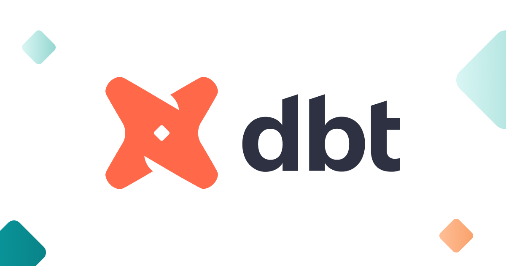

dbt(data build tool) is a data transformation tool that uses SQL select statements to transform data. It connects to
the data warehouse and runs SQL code against the warehouse to transform data. dbt allows you to create complex models,
use variables and macros (aka functions), run tests, generate documentation, and many more.

dbt does not extract or load data, but it is powerful at transforming data that's already available in the database or
data warehouse. dbt does the **T** in ELT (Extract, Load, Transform) processes.

## Pre-requisite

### Install dbt CLI

You can install dbt command-line interface (CLI) by running below command. This will install dbt along with its
BigQuery adapter and other dependencies.

>`pip install dbt-bigquery`

### Verify dbt installation

Run below command to verify the dbt installation.
>`dbt --version`

The output will be the installed dbt version and BigQuery plugin version.

### Generate BigQuery Credentials

In order to let dbt connect to your warehouse, you'll need generate a keyfile. This is analogous to using a database
username and password with most other data warehouses. You need to make sure the service account has the following
permission:

- BigQuery Data Editor
- BigQuery Job User
- BigQuery User

This service account JSON key file will be needed in dbt project setup to set the value of keyfile. in
~/.dbt/profiles.yml

## Basics of a dbt project

A dbt project is a directory containing `.sql` and `.yml` files. The minimum required files are:

- A project file named `dbt_project.yml`: This file contains configurations of a dbt project.
- Model(s) (`.sql` files): A model in dbt is simply a single `.sql` file containing a single `select` statement.
Every dbt project needs a dbt_project.yml file — this is how dbt knows a directory is a dbt project. It also contains important information that tells dbt how to operate on your project.

>:bulb: A dbt model is basically a `.sql` file with a **SELECT** statement.

### dbt Commands

Here is the list of common commands:

- dbt --version
- dbt init
- dbt run
- dbt test
- dbt debug
- dbt source freshness
- dbt docs generate
- dbt docs serve
- dbt clean

### dbt Project Setup

You can use `dbt init` to generate sample files/folders. In particular, `dbt init project_name` will create the
following:

- a ~/.dbt/profiles.yml file if one does not already exist
- a new folder called `[project_name]`
- directories and sample files necessary to get started with dbt

>:warning: Caution: Since `dbt init` generates a directory named `[project_name]`, and in order to avoid any conflict,
> you should not have any existing folder with an identical name. The result is a directory with the following sample
> files.

```
dbt_bigquery_demo
├── analyses
├── macros
├── models
│   └── example
│       ├── my_first_dbt_model.sql
│       ├── my_second_dbt_model.sql
│       └── schema.yml
├── seeds
├── snapshots
├── tests
├── .gitignore
├── dbt_project.yml
└── README.md
```

- **analyses**: Any .sql files found in this folder will be compiled to raw SQL when you run dbt compile. They will not
be run by dbt but can be copied into any tool of choice.

- **macros**: dbt allows users to create macros, which are SQL-based functions. These macros can be reused across our
project.

- **models**: Directory to keep all the models .sql files.

- **snapshots**: In dbt, snapshots are select statements, defined within a snapshot block in a .sql file (typically in
your snapshots directory). You'll also need to configure your snapshot to tell dbt how to detect record changes. dbt
snapshot command will pick the .sql files from this directory.

- **tests**: Directory to keep test files.

## dbt Models and Features

### dbt models

The dbt model name is the filename of the sql file in the `models` directory. There is no DDL/DML that needs to be
written around this. This allows the developer to focus on the logic.
Each model is dbt is:

- A *.sql file
- Select statement, no DDL or DML
- Can have Macros that will automatically generate code
- A file that dbt will compile and run in our Data Warehouse

The model name may differ from the table name in the database.
[hint: Aliases](https://docs.getdbt.com/docs/building-a-dbt-project/building-models/using-custom-aliases)

Command to execute models:
> `dbt run`

### Run models

You can run all models in your dbt project by executing `dbt run`.
dbt will solve for us:

- Generate DDL and DML code
- Resolve schema name
- Build and track dependencies automatically
- Track and check data sources

When a model is executed, the statements in the models are created as a table or view in the data warehouse. The default
materialization is a view.

### Materializations

Materializations are strategies for persisting dbt models in a warehouse. There are four types of materializations built
into dbt. They are:

- table
- view
- incremental
- ephemeral

By default, dbt models are materialized as "views". Models can be configured with a different materialization by
supplying the materialized configuration parameter as shown below.

in `dbt_projects.yml`

```
models:
  dbt_bigquery_demo:
    # Config indicated by + and applies to all files under models/example/
    staging:
      +materialized: table
    mart:
      +materialized: view
```

Alternatively, materializations can be configured directly inside the model sql files.

```
{{ config(materialized='table') }}
```

More information about which meterialization to choose, their pros/cons can be found
[here](https://docs.getdbt.com/docs/building-a-dbt-project/building-models/materializations).

### Jinja & Macros

dbt uses Jinja templating language, making a dbt project an ideal programming environment for SQL. With Jinja, you can
do transformations that are not normally possible in SQL, like using environment variables, or macros — abstract
snippets of SQL, which is analogous to functions in most programming languages. Whenever you see a {{ ... }}, you're
already using Jinja. For more information about Jinja and additional Jinja-style functions defined, you can check
[dbt documentation](https://docs.getdbt.com/docs/building-a-dbt-project/jinja-macros/).

## Using Variables

### Define a variable

You can define your variables under the `vars` section in your `dbt_project.yml`. For instance, let's define a variable
called `start_date` whose default value is '2021-05-01' and another one called `end_date` whose default value is
'2021-05-31'.

```
name: 'dbt_bigquery_demo'
version: '1.0.0'
config-version: 2

vars:
  start_date: "'2021-05-01'"
  end_date: "'2021-05-31'"
```

### Use a variable

You can use variables in your dbt models via `var()` Jinja function `{{ var("var_key_name") }}`.

## Macros

There are many useful transformations and useful macros in dbt_utils that can be used in your project. However, there
are also other dbt packages available on [dbt Hub](https://hub.getdbt.com/) containing some useful macros and other
utilities which are worth taking a look.
Now, let's add dbt_utils to our project and install it by following the below steps:

1. Add dbt_utils macro to your `packages.yml` file, as follows:

```
packages:
  - package: dbt-labs/dbt_utils
    version: 0.8.2
```

2. Run `dbt deps` to install the package.

## Complex dbt models

The models (selects) are usually stacked on top of one another. For building more complex models, you will have to use
ref() macro. ref() is the most important function in dbt as it allows you to refer to other models. For instance, you may have a model (aka SELECT query) that does multiple stuff, and you don’t want to use it in other models. It will be difficult to build a complex model without using macros introduced earlier.

### dbt model using `ref()` and global variables

We can build more complex models using the two or more dbt models. Below example shows how to reference a model using `ref()` and global variables `var()`.

```
SELECT 
    date,
    country_name,
    AVG(new_confirmed) OVER(
      PARTITION BY country_name
      ORDER BY date
      ROWS BETWEEN 6 PRECEDING AND CURRENT ROW )
    as weekly_new_cases
FROM {{ ref('covid_stats') }}
WHERE date BETWEEN {{ var('start_date')}} AND {{ var('end_date') }}
```

Few points about the query above:

- `{{ ref('dbt_model_name') }}` is used to refer to dbt models available in the project.
- You can get a column from the model like `{{ ref('dbt_model_name') }}.column_name`.
- You can use variables defined in dbt_project.yml file by `{{ var("variable_name) }}`.

You can also see the compiled SQL code snippet in the `target/compiled` directory. This is very useful particularly if you want to run the query outside the dbt tool.

## Run Tests in dbt

Testing is important in ensuring data quality and to know about problems in advance. dbt provides ways to integrate testing in a data pipeline. Some tests are already shipped with dbt, while other can be found in open source package on [dbt Hub](https://hub.getdbt.com/). There are two ways of defining tests in dbt:

1. A singular test is testing in its simplest form: If you can write a SQL query that returns failing rows, you can save that query in a `.sql` file within your test directory. It's now a test, and it will be executed by the `dbt test`
command.

2. A generic test is a parametrized query that accepts arguments. The test query is defined in a special test block (like a macro). Once defined, you can reference the generic test by name throughout your .yml files—define it on models, columns, sources, snapshots, and seeds. dbt ships with four generic tests built in, these are:

- unique: this checks if all the values in the columns are unique.
- not_null: this checks if a column contains null values.
- accepted_values: this compares the content of a column against a list of accepted values.
- relationships: this checks if the values in a column exist in a different table.

An example of these tests on the model is shown below:

```
version: 2

models:
  - name: covid_stats
    description: "A starter dbt model"
    columns:
      - name: date
        description: "Date in ISO format. Also the primary key for this table"
        tests:
          - not_null
      - name: country_name
        description: "Country name"
        tests:
          - not_null
```

You can also write custom quality test cases to check for specific business logic by combining Jinja and SQL. These tests can be configured by referencing them in the same YAML file used for a given model. If the data fails to operate under the set expectations in the YAML file, dbt flags the error.

Command to run the tests
> `dbt test`

There are also additional tests available in one of extension package of dbt -
[dbt_expectations](https://hub.getdbt.com/calogica/dbt_expectations/latest/)

## Generate Documentation in dbt

Documentation is essential when updating the data pipeline with a new feature or if another developer takes over the project. dbt helps you to generate documentation for your project. dbt goes through the project and the warehouse to gather the required information. This includes your actual code, a DAG, tests, column data types, and tables. You can add additional model details such as tests and descriptions in YAML for more comprehensive documentation. You can
generate documentation for your dbt project by simply running `dbt docs generate` command.
In addition to `dbt docs generate`, dbt docs can also serve a webserver with the generated documentation. To do so, you need to simply run `dbt docs serve`. It starts a web-server on port 8000 to serve your documentation locally. The
webserver is rooted in your `target/` directory.

## Other Features

### Database administration using Hooks & Operations

There are database management tasks that require running additional SQL queries, such as:

- Create user-defined functions
- Grant privileges on a table
- and many more

dbt has two interfaces (hooks and operations) for executing these tasks and importantly version control them. Hooks and operations are briefly introduced here. For more info, you can check [dbt documentation](https://docs.getdbt.com/docs/building-a-dbt-project/hooks-operations).

### Hooks

Hooks are simply SQL snippets that are executed at different times. Hooks are defined in the `dbt_project.yml` file.
Different hooks are:

- `pre-hook`: executed before a model is built
- `post-hook`: executed after a model is built
- `on-run-start`: executed at the start of `dbt run`
- `on-run-end`: executed at the end of `dbt run`

### Operations

Operations are a convenient way to invoke a macro without running a model. Operations are triggered using
`dbt run-operation` command.

Note that, unlike hooks, you need to explicitly execute the SQL in a
[dbt operation](https://docs.getdbt.com/docs/building-a-dbt-project/hooks-operations#operations).

## Development - Best Practices

- Never reference the schema directly. Use the *ref* and *source* macros.
- Use macros to make sure your business logic is maintained only in one place.
- Use variables to avoid repeating yourself and make your models scalable.
- Always define your sources with a freshness threshold.

[Get back to homepage](/README.md)
